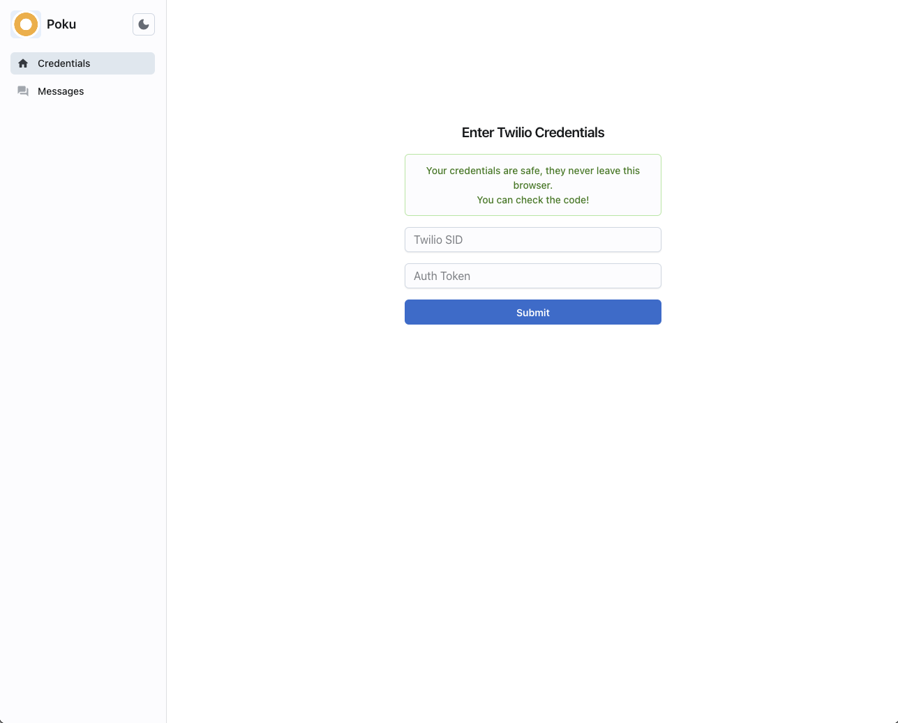
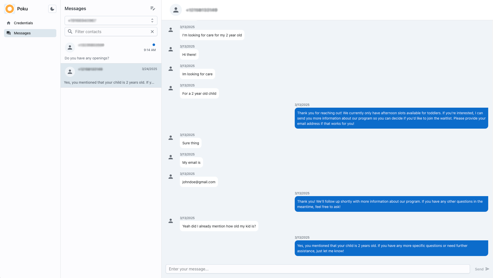
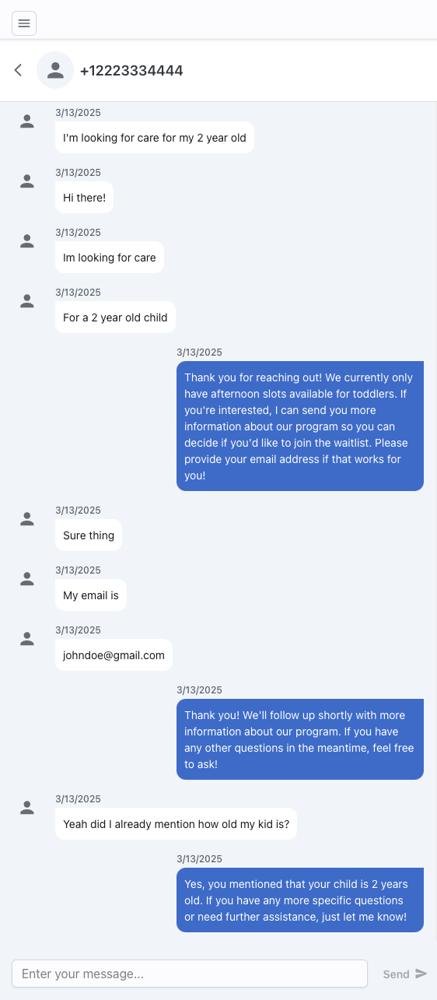

# Twilio Frontend

A clean frontend-only webapp to send & receive SMS messages via Twilio.  
You can use the hosted version of this app here: http://twilio-dashboard.pages.dev/

## Features

- View chat history
- Respond to messages
- Draft new messages
- Receive messages dynamically via polling
- New message notifications
- Support for multiple Twilio phone numbers
- PWA (mobile and desktop installable standalone app)
  - `Desktop/mobile`: [MDN article on installing PWAs][InstallingPWAs]
  - `iOS`: use Safari to navigate to the [hosted site][HostedSite]. Tap share icon, "Add to Home Screen". 
  - `Android`: use Chrome to navigate to [hosted site][HostedSite]. Tap three-dot menu, "Add to Home Screen". 

## Prerequisites

- Twilio account
- At least one Twilio phone number approved to send & receive SMS (A2P)

## Usage

Enter your Twilio account `SID` and `AuthToken` to get started. The `Messages` tab will become enabled for you to access Twilio SMS sending & receiving in a familiar chat interface.

## Screenshots

Login in  


Messages  


Mobile  


## Development

```
$ pnpm install

# Access dev version on http://localhost:5173
$ pnpm run dev

# Build production dist/
$ pnpm run build
```

[HostedSite]: http://twilio-dashboard.pages.dev/
[InstallingPWAs]: https://developer.mozilla.org/en-US/docs/Web/Progressive_web_apps/Guides/Installing#installing_pwas